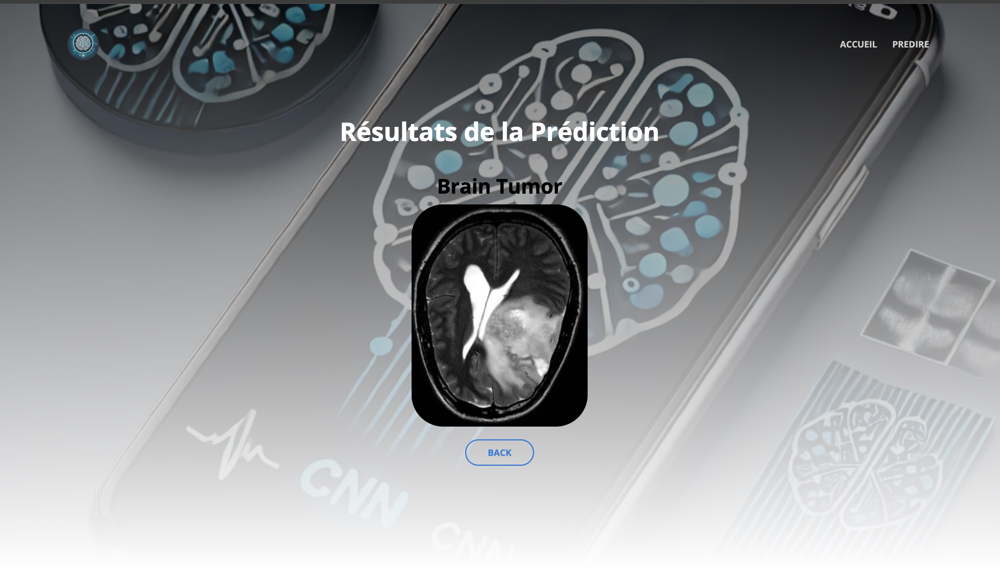

# Détection de Tumeurs - Application Flask

## Description
Cette application Flask permet de détecter des tumeurs à partir d'images médicales téléchargées par l'utilisateur. Elle utilise un modèle de deep learning pour analyser les images et fournir un diagnostic prédictif.

---

## Fonctionnalités
- **Téléchargement d'images** : L'utilisateur peut envoyer une image médicale.
- **Prédiction automatique** : Le modèle de deep learning analyse l'image et détermine la présence ou non d'une tumeur.
- **Affichage des résultats** : L'application affiche l'image téléchargée et le diagnostic.
- **Interface Web** : Interface simple et intuitive utilisant Bootstrap.

---

## Installation

### 1. Cloner le projet
```bash
git clone https://github.com/votre-repo/tumor-detection.git
cd tumor-detection
```

### 2. Installer les dépendances
```bash
pip install -r requirements.txt
```

### 3. Lancer l'application
```bash
python run.py
```
L'application sera accessible à l'adresse : `http://127.0.0.1:5000/`


## Utilisation
1. Accédez à la page d'accueil.
2. Téléchargez une image médicale au format `.png`, `.jpg`, ou `.jpeg`.
3. Cliquez sur **Prédire**.
4. Le résultat s'affiche avec l'image et la classification (tumeur détectée ou non).

---

## Modèle de Prédiction
Le modèle de deep learning utilisé est un **CNN** (Convolutional Neural Network) entraîné sur un dataset de scans médicaux. Il a été optimisé pour la classification binaire (présence ou absence de tumeur).


## Auteur
Développé par **[Abderrahim OUAHAB]**

## Licence
MIT License

